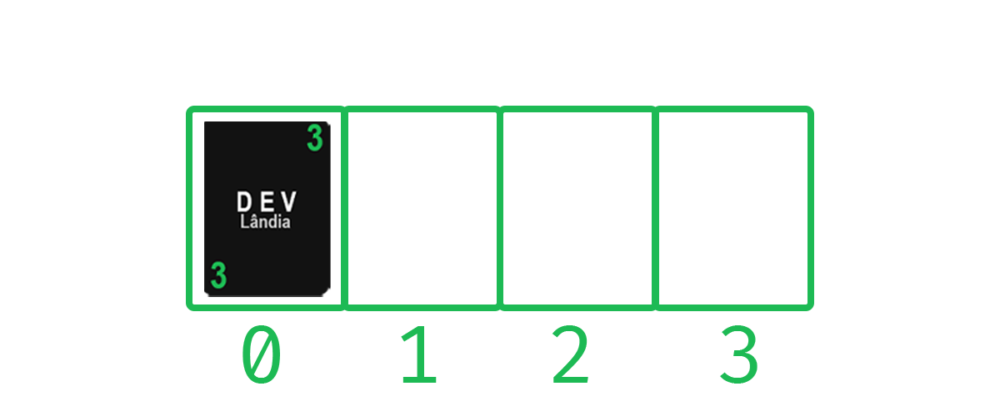
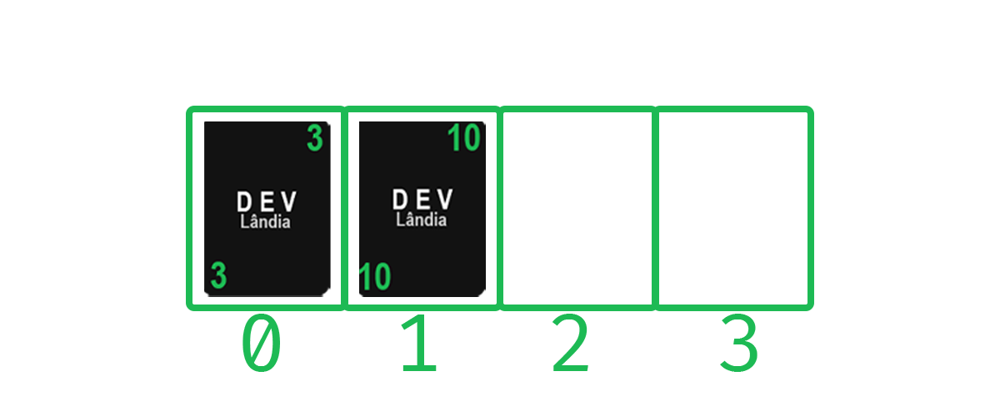
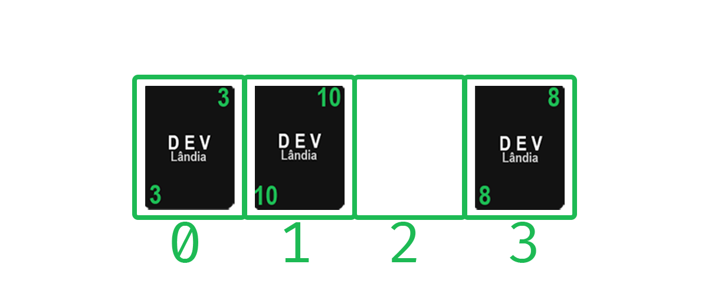
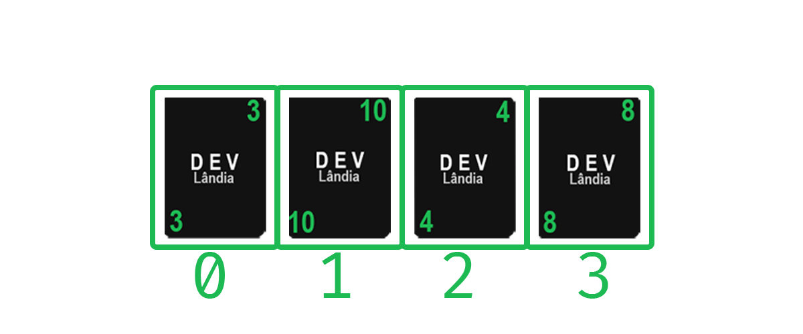

# 🌌 Listas
A lista é uma estrutura de dados para armazenar valores e cada um desses valores são identificados com um index ou chave (são a mesma coisa), as listas também são chamadas de vetores ou variável indexada.

## ❓ Porque usar Listas?
Imagine que você e eu precisamos fazer uma missão que é pegar as seguintes informações: tamanho, tem água e distância do sol do planeta Vênus, isso é bem simples, neh? É só criar 3 variaveis, mas agora imagina para mais 2 planetas além de Vênus, já são 9 variaveis, ou seja, variaveis acabam sendo dificeis para usar então precisamos recorrer as listas.


## ⚖ 10 Mandamentos das listas
Algumas leis que devem ser respeitadas ao manipular listas, partindo do fato que estamos entendendo lista com a linguagem C:<br />
  1. 🆔 O nome da lista nunca começa com números ou caracters especiais.
  2. 🎯 Tenha sempre um tamanho exato de uma lista.
  3. 🏹 Nunca altere o tamanho de uma lista.
  4. 🤴 Tenha sempre um tipo de lista (float, int, char...)
  5. 🏴‍☠️ Nunca altero o tipo de uma lista.
  6. 💀 Nunca coloque mais de um tipo na mesma lista.
  7. 🥇 A primeira posição tem que ser 0.
  8. ⚙ Todas as posições devem ser inteiras maior ou igual a 0.
  9. ⚠ Ou seja sem letras, números negativos ou números quebrados em um index.
  10. 👼 Não se preocupe em ficar memorinzando essas regrinhas, com o  tempo você pega o jeito, só pratique 😉.

## 🗡 Declarando uma  lista em C
Em C a declaração de uma lista é bem simples, primeiro o tipo da lista, segundo o nome e depois a quantidade de posições, *TIPO* NOME_DA_LISTA [QUANTIDADE], por exemplo:
```C
int lista[3]; // TIPO NOME[POSIÇÕES]
```

```C
char lista[3]; // TIPO NOME[POSIÇÕES]
```

## 🤠 Inicializando uma lista
Existem algumas formas de incializar uma lista em C, eu vou apresentar as duas formas mais utilizadas: <br />

**1º** Nesse caso o compilador vai alocar 3 espaços na memória para essa determinada lista.
```C
int lista[3] // [2191, 499, 3125248];
```
Dentro de cada posição vai ter esses números muito loco, eles representam a memória em que essa posição foi alocada (não se preocupe com isso agora).<br />


**2º** Aqui inicializamos uma lista já com valores dentro dela.
```C
int lista[3] = { 1, 2, 3 }; // [1, 2, 3]

int lista[3] = {};       // [0, 0, 0]

int lista[3] = { 0 };    // [0, 0, 0]

int lista[3] = { 1 };    // [1, 0, 0]

int lista[3] = { 1, 2 }; // [1, 2, 0]
```
Não tem muito segredo as inicialização de listas, recomendo você ir testar alguns desses ou até fazer o seu próprio exemplo é só iniciar uma lista e dar um print em cada posição:

```C
int lista[3] = { 1, 2 };
printf("%d %d %d", lista[0], lista[1], lista[2]);
```

A mesma coisa acontece para **qualquer outro tipo**:
```C
char lista[3] = { 'J', 'a', 'o' }; // ['J', 'a', 'o']

char lista[3] = {};           // ['', '', '']

char lista[3] = { 'D', 'e' }; // ['D', 'e', '']

float lista[3] = { 0 };       // [0, 0, 0]

float lista[3] = { 1.2 };     // [1.2, 0, 0]
```

Se for fazer os testes não esqueça de alterar o **%d** para **%c** para char e **%f** para float.

```C
char lista[3] = { "J", "a", "o" };

printf("%c%c%c", lista[0], lista[1], lista[2]);
```

## 👣 Passo a Passo com baralho
Nada melhor que aprender enquanto olha oque está acontecendo, então vamos entender listas com alguns exemplos bem simples de cartas.<br/>

### 🔢 Lista de inteiros
Vamos criar uma lista de inteiros assim como vimos anteriormente:
```c
int cartas[4];
```
Ao rodar isso nós vamos ter essa lista:


Legal, neh? Consegue ver o porque essa lista tem 4 posições sendo que a última posição é representada pelo número 3?... Pois o número 0 não é ignorado na programação, como diz o ditado "Bons nerds sempre começam a contar pelo 0".

Vamos começar a manipular essa lista, eu quero colocar a carta 3 na primeira posição da lista, para eu conseguir ter o acesso a essa posição eu faço:
```C
cartas[0]
```
Boa! Já temos acesso a essa posição e como o meu objetivo é colocar algo la dentro eu vou usar o "**=**":
```C
cartas[0] =
```
Nicee! Acabamos de dizer para o compilador que queremos que a **posição 0** da lista chamada **carta receba** alguma coisa que no caso é nossa carta 3 para isso:
```C
cartas[0] = 3;
```
E VOILÁ! agora nossa lista está assim:


Agora vamos tentar colocar o número 10 na **posição 1**, para isso é a mesma coisa:

```C
cartas[1]
```
Temos acesso e como queremos **colocar** o 10 na lista então:
```C
cartas[1] = 10;
```
E assim está nossa lista agora:


Já tá fácil, não? Então aqui vai uma pergunta: <br>`Eu posso colocar a carta 8 na posição 3, assim "pulando" a posição 2?` 🤔... Vamos tentar fazer isso:

```C
cartas[3]
```
Boa temos acesso, agora vamos colocar o 8 la dentro:

```C
cartas[3] = 8;
```

Vamos checar nossa lista para ver se deu certo 😱😱


Deu certo, Dev! Nesse exato momento temos a posição 0, 1 e 3 com valores e a posição 2 sem "nada". `Então para terminar esse exemplo tente escrever a linha de código para colocar o número 4 na posição 2 da lista`, ficando assim:



## 🔠 Lista de caracteres
Você já usou o tipo **string** alguma vez? Se sim, você sabia que em muitas linguagens de programação esse tipo na verdade NÃO EXISTE? 😱 O tipo string é uma **cadeia de caracteres** ou seja tudo que possui mais de um caractere então "i" é apenas um caractere e "Dev Lândia" É uma cadeia de caracteres, ou seja, uma string.<br>

Então se quisermos armazenar um nome em C, vamos precisar de uma lista em que cada posição armazena um caractere (no final vou mostrar um atalho), vamos colocar o nome Jão em uma lista:
```C
char nome[3];
```
Como Jão tem apenas 3 letras então criamos uma lista com 3 posições a 0, 1 e 2.


E agora vamos colocar o **O** na **terceira posição**:
```C
nome[2] = 'O';
```
Lembrando de usar **aspas simples** e não aspas duplas, agora nossa lista tá  assim:


Então a lista de char funciona que nem a lista de inteiros, acho que tu já pegou a ideia daqui, para acabar o exemplo vamos colocar o J e A.

```C
nome[0] = 'J';
nome[1] = 'A';
```
E por fim nossa lista ficou cheia:


## 🧵 Strings
Assim como eu disse, eu vou te mostrar uma maneira mais fácil de armazenar strings em C:<br>

Para isso você precisa usar os **ponteiros** que caso você esteja iniciando em C não precisa se preocupar com isso agora, apenas entenda que funciona. Para criar um ponteiro nós usamos o * ficando assim:
```C
char* nome;
```
Os ponteiros é um tipo de variavel especial, com eles temos o poder de fazer coisas incriveis como isso:

```C
nome = "Jao" // Dessa vez use aspas dupla
printf("%s", nome); // %s para strings
```
Porém pode ser um pouco inimigo no seu código, então use a função `free()` (evitar vazamento de memória) para cada ponteiro que você criou , para usar é só importar a biblioteca `stdlib.h` e no final do código coloque:
```C
free(ponteiro1); // um free para cada ponteiro
free(ponteiro2); 
```

🎉 E pronto!!, Lembrando que se você está com dificuldades saiba que é normal isso e programação precisa de tempo, prática e uma boa pausa para o seu cérebro entender tudo.

```C
char* mensagem = "Tenha um ótimo dia =)"; // mensagem para você que esta lendo.
```

🧠 Você pode aprender qualquer coisa e até a próxima.

---
<p align="center">Feito com 💚 por João Victor Ramalho Alves</p>