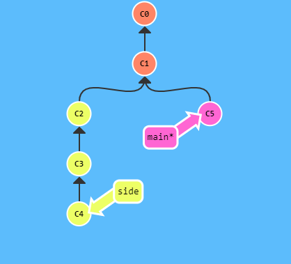
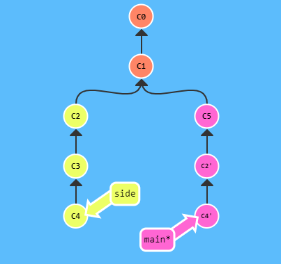

It takes on the following form:

- `git cherry-pick <Commit1> <Commit2> <...>`

Using this, you could copy specifics commits and past them in HEAD.

If we have the situation down below, and we want to copy just C2 and C4 to main:



We could just do this command:

```bash
$ git cherry-pick C2 C4
```

The result should be:


