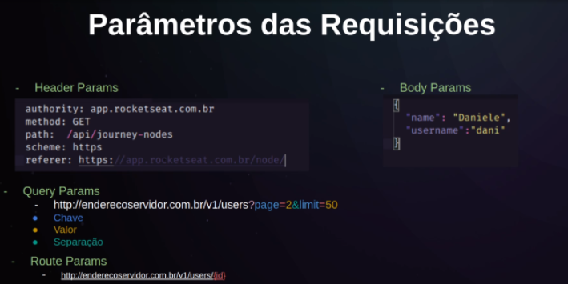

> 💡 Pergunta: Liste os principais métodos de requisição e os HTTP Codes mais utilizados (junto ao que significam). 

Responda aqui 

- GET ⇒ Usado para leitura
- POST ⇒ Para criação
- PUT ⇒ Para atualização
- DELETE ⇒ Para deleção
- PATCH ⇒ Para atualização especifica

## 👌 2XX

- 200 - OK 

    Mostrar que a requisição foi bem sucedida

- 201 - Created 

    Usado para mostrar que um dado foi criado corretamente, geralmente são usados após uma Request POST

## 👎 4XX

- 400 - Bad Request 

    Mostrar que a requisição não foi entendida e possui errors de sintaxe.

- 401 - Unauthorized 

    Mostrar que o cliente não é reconhecido pelo servidor, portanto ele(a) precisa fazer se autenticar para conseguir fazer a requisição.

- 403 - Forbidden 

    Parecido com o 401, porém o servidor sabe quem é o cliente, porém ele(a) não pode ter acesso aquele conteúdo.

- 404 - Not Found 

    Mostra que esse recurso não existe, o endpoint pode ser valido, porém aquele recurso não existe ou o servidor envia um 404 ao invés de um 403, pois se o cliente não tem acesso ele(a) não precisa saber que existe aquele recurso.

## 💻 5XX

- 500 - International Server Error 

    O servidor falhou. Não Soube como lidar com a requisição.

- 502 - Bad Gateway 

    Ao servidor fazer uma requisição recebeu uma resposta inválida, ou seja, não a request feita pelo cliente não pode ser entregue por conta da resposta inválida de um terceiro.

## 🧼 Boas práticas

- A utilização correta dos métodos HTTP
- A utilização correta dos status no retorno das respostas
- padrão de nomenclatura
    - Busca de usuários - GET 
        - **http://enderecoservidor.com/v1/users**
    - Busca de usuários por id - GET 
        - **http://enderecoservidor.com/v1/users/1**
    - Busca de endereço do usuário - GET 
        - **http://enderecoservidor.com/v1/users/1/address**
    - Deleção de um usuário - DELETE 
        - **http://enderecoservidor.com/v1/users/1**
    - Atualização do status do usuário - PATCH 
        - **http://enderecoservidor.com/v1/users/1/status**

## 🪂 Parâmetros

